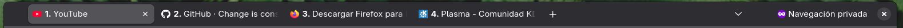
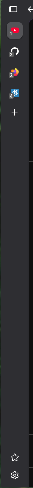
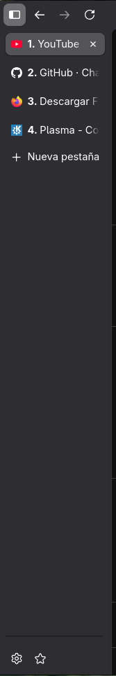

# Firefox Numbered Tabs (Horizontal & Vertical)

Un script CSS liviano y eficiente para añadir números correlativos a las pestañas de Firefox. Funciona de forma inteligente tanto en el modo horizontal clásico como en el nuevo sistema de pestañas verticales (adaptándose si la barra está expandida o colapsada).

## Características
- **Modo Horizontal:** Muestra el número antes del título.
- **Modo Vertical Expandido:** Muestra el número antes del título de forma limpia.
- **Modo Vertical Colapsado:** Transforma el número en un cómodo *badge* (notificación) con fondo gris oscuro abajo a la izquierda del favicon para que no se pierda de vista.

## Capturas

### Horizontal

### Vertical

| Colapsado | | Expandido |
|:---------:|:-:|:---------:|
|  | |  |

## Instalación paso a paso

### Paso 1: Activar hojas de estilo en Firefox
1. Abre una pestaña en Firefox y escribe `about:config` en la barra de direcciones.
2. Acepta la advertencia de riesgo.
3. Busca la preferencia `toolkit.legacyUserProfileCustomizations.stylesheets` y cámbiala a **`true`** haciendo doble clic sobre ella.

### Paso 2: Copiar el archivo
1. Abre otra pestaña y escribe `about:profiles`.
2. Busca tu perfil activo (suele decir *Perfil predeterminado: sí*) y en la fila **Directorio de raíz**, haz clic en **Abrir carpeta**.
3. Descarga la carpeta `chrome` de este repositorio (o creala) y pega el archivo `userChrome.css` dentro de ella.

### Paso 3: Reiniciar
Cierra Firefox por completo y vuélvelo a abrir.
